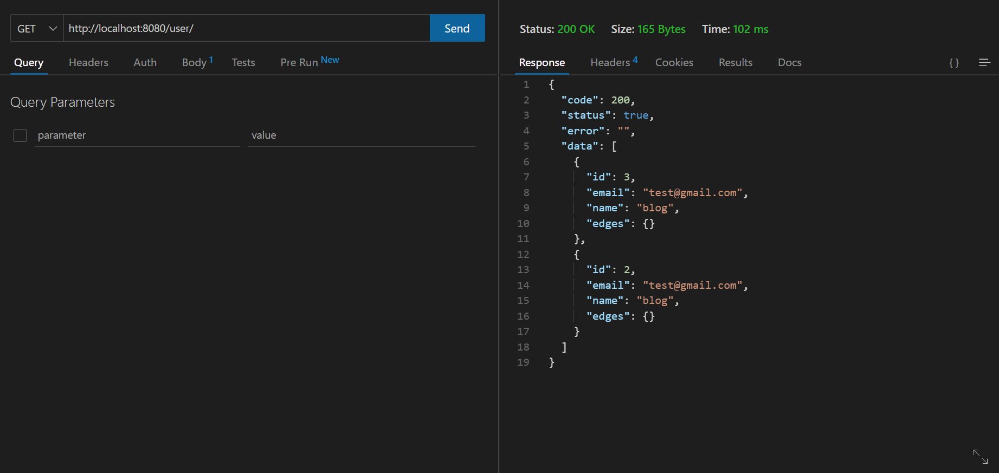
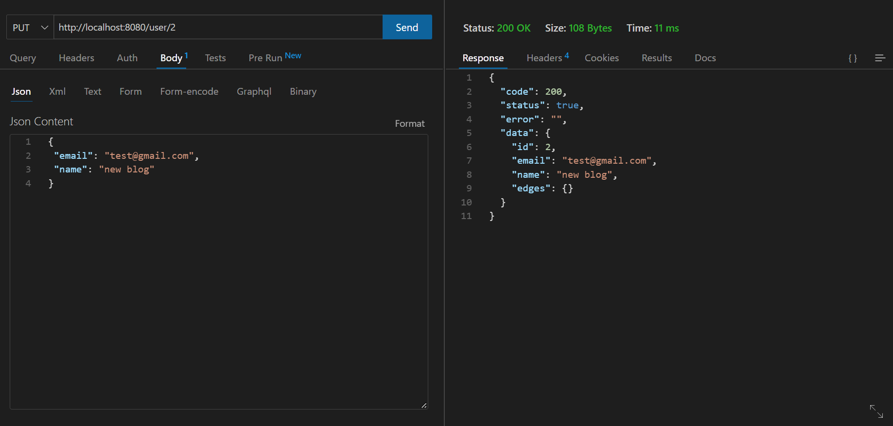
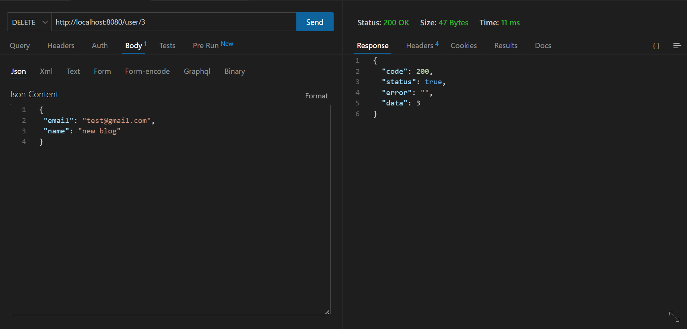
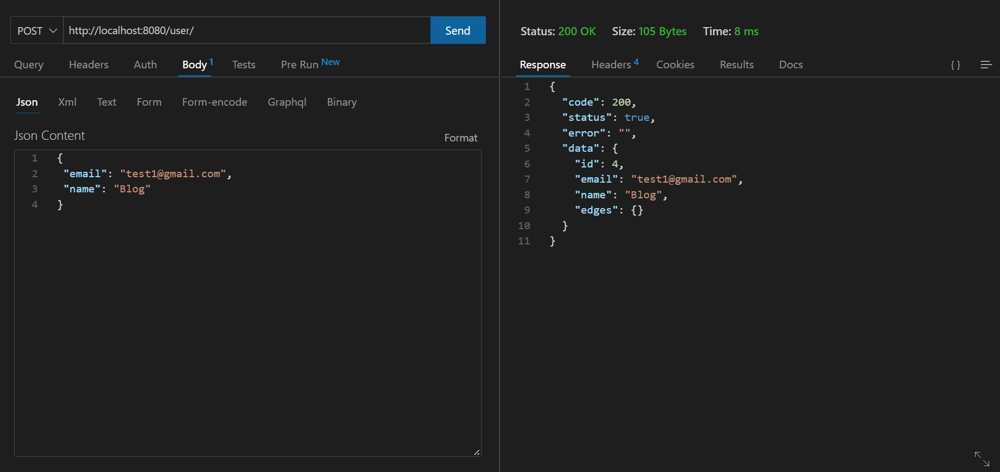
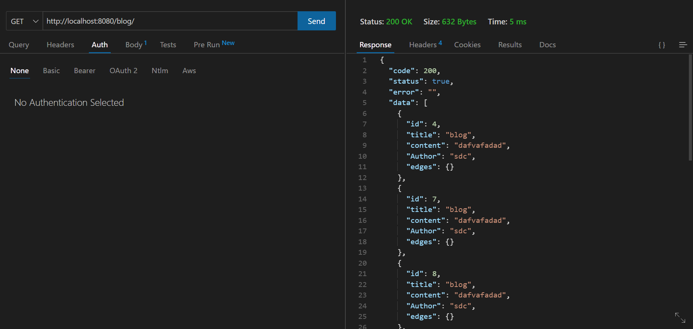
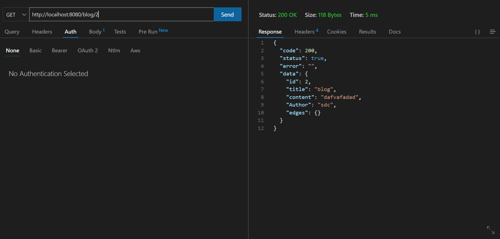
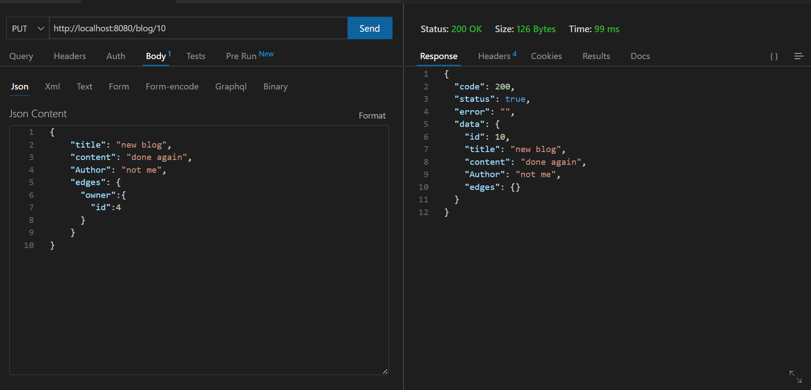
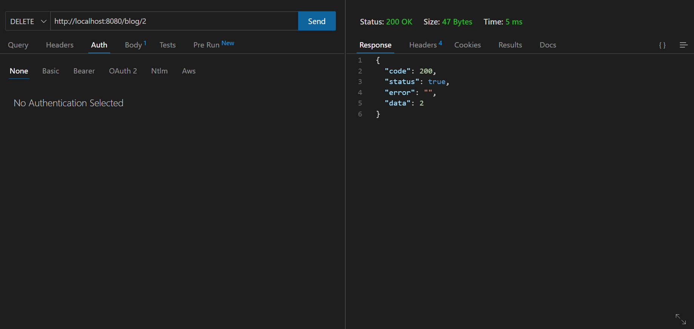
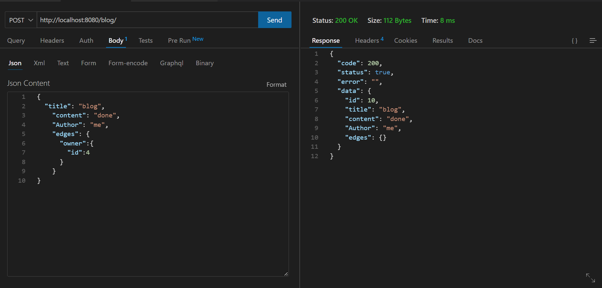

# Go Blog

## Setup

To install, run and test you need to install [GO](https://go.dev/dl/) and set your GO workspace.

1. This project has go.mod . You should be able to simply install and start:

```sh
$ git clone https://github.com/mohitkadwe19/go-blog
$ cd go-blog
$ go mod tidy
```


## Run

```sh
go run ./server.go
```

## output

```sh
[GIN-debug] [WARNING] Creating an Engine instance with the Logger and Recovery middleware already attached.

[GIN-debug] [WARNING] Running in "debug" mode. Switch to "release" mode in production.
 - using env:   export GIN_MODE=release
 - using code:  gin.SetMode(gin.ReleaseMode)

[GIN-debug] GET    /blog/                    --> Blog/controller.BlogGetAllController (3 handlers)
[GIN-debug] GET    /blog/:id                 --> Blog/controller.BlogGetByIDController (3 handlers)
[GIN-debug] POST   /blog/                    --> Blog/controller.BlogCreateController (3 handlers)
[GIN-debug] PUT    /blog/:id                 --> Blog/controller.BlogUpdateController (3 handlers)
[GIN-debug] DELETE /blog/:id                 --> Blog/controller.BlogDeleteController (3 handlers)
[GIN-debug] GET    /user/                    --> Blog/controller.UserGetAllController (3 handlers)
[GIN-debug] GET    /user/:id                 --> Blog/controller.UserGetByIDController (3 handlers)
[GIN-debug] POST   /user/                    --> Blog/controller.UserCreateController (3 handlers)
[GIN-debug] PUT    /user/:id                 --> Blog/controller.UserUpdateController (3 handlers)
[GIN-debug] DELETE /user/:id                 --> Blog/controller.UserDeleteController (3 handlers)
2023/01/14 18:44:05 Server started on port 8080
```

## USER API

### GET /user/



### GET /user/:id


### PUT /user/:id


### DELETE /user/:id


### POST /user/


## BLOG API

### GET /blog/
 

### GET /blog/:id


### PUT /blog/:id


### DELETE /blog/:id
 

### POST /blog/
